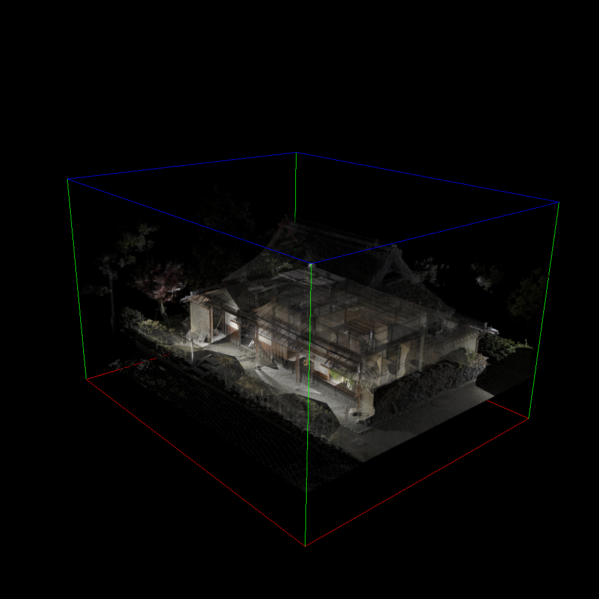
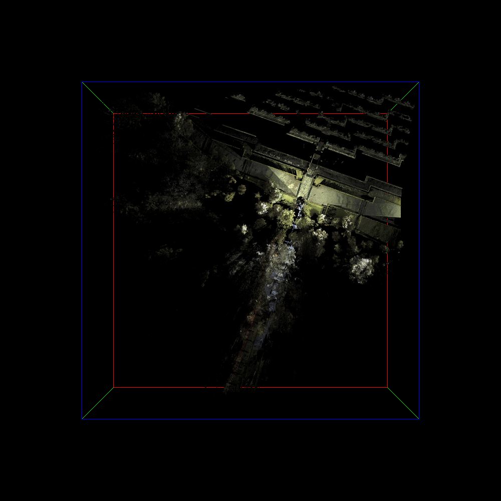

# PLY2SPBR

## Overview
- Convert ply file(.ply) to spbr(.spbr) file.
- Optionally, crop the selected area.

### USAGE
```
$ ./ply2spbr [input.ply] [output.spbr] [x_min] [y_min] [z_min] [x_max] [y_max] [z_max]
```

## Result
### After cropping
|中島家|ボロブドゥール寺院|
|:-:|:-:|
|||